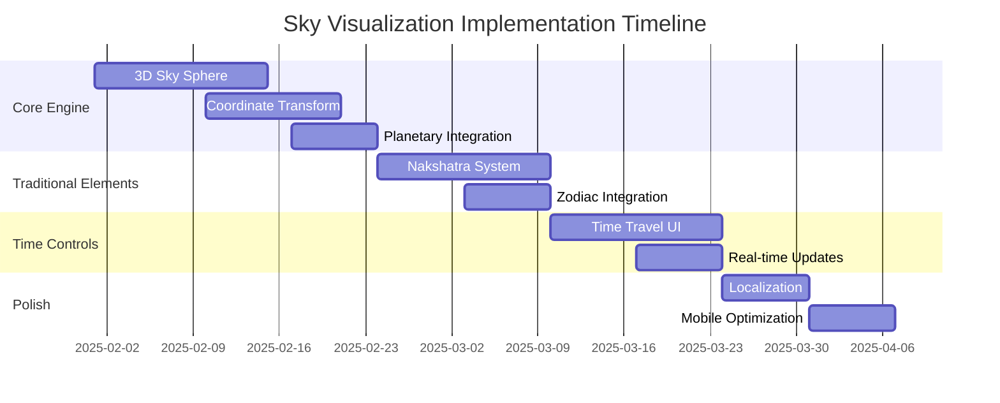

# Milestone: Interactive Sky Visualization

**Target Completion**: Q2 2025 (12 weeks)  
**Priority**: High  
**Category**: Feature Enhancement  
**Dependencies**: Existing ephemeris system, web frontend

## Overview
Implement an interactive sky visualization feature that accurately depicts the real-time astronomical sky using the panchangam system's precise ephemeris calculations. This will showcase the computational sophistication of the application and provide an immersive way to understand traditional Hindu astronomy.

## Success Criteria
- ✅ Accurate planetary positions (±1 arcminute precision)
- ✅ Real-time sky updates with time controls
- ✅ Traditional nakshatra and zodiac overlays
- ✅ Mobile-responsive 3D/2D sky views
- ✅ Cultural integration with Sanskrit terminology
- ✅ 60fps performance on desktop, 30fps on mobile

## Business Value
- **Educational Impact**: Visual learning of panchangam concepts
- **Technical Showcase**: Demonstrates advanced astronomical calculations
- **User Engagement**: Interactive features increase app stickiness
- **Cultural Preservation**: Traditional astronomy in modern interface
- **Competitive Advantage**: Unique feature differentiating from other calendar apps

---

## Issue Breakdown

### Epic 1: Core Sky Rendering Engine
**Estimated Effort**: 4 weeks | **Priority**: Critical

#### Issue #45: Implement 3D Sky Sphere Rendering System
**Labels**: `enhancement`, `sky-visualization`, `3d-graphics`  
**Effort**: 2 weeks | **Assignee**: Frontend Team

**Description:**
Create the foundational 3D sky sphere rendering system using WebGL/Three.js that can display celestial objects at correct positions.

**Acceptance Criteria:**
- [ ] 3D celestial sphere with proper coordinate system
- [ ] WebGL-based rendering with performance optimization
- [ ] Camera controls for sky navigation (zoom, pan, rotate)
- [ ] Stereographic and orthographic projection modes
- [ ] Responsive canvas that adapts to screen sizes
- [ ] Error handling for WebGL unsupported browsers

**Technical Requirements:**
```typescript
interface SkySphere {
  radius: number;
  projection: 'stereographic' | 'orthographic';
  coordinateSystem: 'equatorial' | 'horizontal';
  renderMode: 'webgl' | 'canvas';
}
```

**Dependencies**: None

---

#### Issue #46: Coordinate Transformation System
**Labels**: `enhancement`, `sky-visualization`, `mathematics`  
**Effort**: 1.5 weeks | **Assignee**: Backend/Frontend Team

**Description:**
Implement precise coordinate transformations from ecliptic coordinates (from ephemeris) to screen coordinates for accurate sky object positioning.

**Acceptance Criteria:**
- [ ] Ecliptic to equatorial coordinate conversion
- [ ] Equatorial to horizontal coordinate conversion (observer-specific)
- [ ] Horizontal to screen coordinate projection
- [ ] Coordinate system validation with known star positions
- [ ] Support for different coordinate epochs (J2000, current)
- [ ] Unit tests with astronomical reference data

**Technical Requirements:**
```typescript
interface CoordinateTransform {
  eclipticToEquatorial(coords: EclipticCoords, jd: number): EquatorialCoords;
  equatorialToHorizontal(coords: EquatorialCoords, observer: Observer, time: Date): HorizontalCoords;
  horizontalToScreen(coords: HorizontalCoords, projection: Projection): ScreenCoords;
}
```

**Dependencies**: Issue #45

---

#### Issue #47: Planetary Position Integration
**Labels**: `enhancement`, `sky-visualization`, `backend-integration`  
**Effort**: 1 week | **Assignee**: Full-stack Team

**Description:**
Integrate the existing ephemeris system's planetary position data with the sky visualization frontend.

**Acceptance Criteria:**
- [ ] API endpoint for sky visualization data (`/api/sky-view`)
- [ ] Real-time planetary position updates from ephemeris system
- [ ] Planet visibility calculations (above/below horizon)
- [ ] Planetary symbol rendering with Sanskrit/Hindi names
- [ ] Planet magnitude and color accuracy
- [ ] Error handling for ephemeris data unavailability

**API Specification:**
```go
type SkyVisualizationRequest struct {
    Date      string  `json:"date"`
    Time      string  `json:"time"`
    Latitude  float64 `json:"latitude"`
    Longitude float64 `json:"longitude"`
    Timezone  string  `json:"timezone"`
}

type SkyVisualizationResponse struct {
    Timestamp     time.Time           `json:"timestamp"`
    Observer      Location            `json:"observer"`
    PlanetaryData PlanetaryPositions  `json:"planetary_data"`
    VisiblePlanets []VisiblePlanet    `json:"visible_planets"`
}
```

**Dependencies**: Issues #45, #46

---

### Epic 2: Traditional Astronomical Elements
**Estimated Effort**: 3 weeks | **Priority**: High

#### Issue #48: Nakshatra Visualization System
**Labels**: `enhancement`, `sky-visualization`, `cultural`, `astronomy`  
**Effort**: 2 weeks | **Assignee**: Frontend Team

**Description:**
Implement the 27 nakshatra (lunar mansion) overlay system on the sky visualization with traditional boundaries and symbols.

**Acceptance Criteria:**
- [ ] 27 nakshatra boundaries accurately positioned on sky sphere
- [ ] Current nakshatra highlighting based on Moon position
- [ ] Nakshatra symbols and traditional Sanskrit names
- [ ] Interactive nakshatra information panels
- [ ] Color-coded nakshatra regions
- [ ] Toggle visibility of nakshatra overlay

**Cultural Requirements:**
- Traditional nakshatra division: 13°20' each
- Sanskrit names with transliteration
- Deity associations and characteristics
- Ruling planets and attributes

**Dependencies**: Issues #45, #46, #47

---

#### Issue #49: Zodiac and Ecliptic Integration
**Labels**: `enhancement`, `sky-visualization`, `astronomy`  
**Effort**: 1 week | **Assignee**: Frontend Team

**Description:**
Add ecliptic plane visualization with zodiacal markers and traditional Hindu zodiac signs.

**Acceptance Criteria:**
- [ ] Ecliptic plane rendered as subtle line/band
- [ ] 12 zodiacal sign boundaries and symbols
- [ ] Solar position marker on ecliptic
- [ ] Seasonal markers (equinoxes, solstices)
- [ ] Toggle between Western and Vedic zodiac systems
- [ ] Responsive design for different screen sizes

**Dependencies**: Issues #45, #46, #47

---

### Epic 3: Interactive Time Control System  
**Estimated Effort**: 3 weeks | **Priority**: High

#### Issue #50: Time Travel Interface
**Labels**: `enhancement`, `sky-visualization`, `ui-controls`  
**Effort**: 2 weeks | **Assignee**: Frontend Team

**Description:**
Create an intuitive time control interface allowing users to view the sky at any historical or future moment.

**Acceptance Criteria:**
- [ ] Time slider with granular control (minute to century scales)
- [ ] Play/pause animation controls
- [ ] Speed control for planetary motion (1x to 10000x)
- [ ] Date/time picker for specific moments
- [ ] Real-time mode that follows current time
- [ ] Historical bookmarks for significant astronomical events

**UI Requirements:**
```typescript
interface TimeController {
  currentTime: Date;
  playbackSpeed: number;
  isPlaying: boolean;
  timeRange: { min: Date; max: Date };
  bookmarks: HistoricalEvent[];
}
```

**Dependencies**: Issues #45, #46, #47

---

#### Issue #51: Real-time Sky Updates
**Labels**: `enhancement`, `sky-visualization`, `performance`  
**Effort**: 1 week | **Assignee**: Frontend Team

**Description:**
Implement efficient real-time updates of sky positions with optimized rendering performance.

**Acceptance Criteria:**
- [ ] 60fps performance on desktop browsers
- [ ] 30fps performance on mobile devices
- [ ] Efficient WebGL rendering with object culling
- [ ] Smooth planetary motion interpolation
- [ ] Memory optimization for long-running sessions
- [ ] Performance metrics and monitoring

**Performance Requirements:**
- Frame rate: 60fps desktop, 30fps mobile
- Memory usage: <100MB for extended sessions
- Battery impact: Minimal on mobile devices

**Dependencies**: Issues #45, #46, #47, #50

---

### Epic 4: Advanced Features & Polish
**Estimated Effort**: 2 weeks | **Priority**: Medium

#### Issue #52: Cultural Localization Support
**Labels**: `enhancement`, `sky-visualization`, `i18n`, `cultural`  
**Effort**: 1 week | **Assignee**: Frontend Team

**Description:**
Add comprehensive localization support for different languages and cultural astronomical systems.

**Acceptance Criteria:**
- [ ] Sanskrit/Devanagari text rendering
- [ ] Hindi, Tamil, English language support
- [ ] Cultural planet names and descriptions
- [ ] Regional constellation patterns
- [ ] Accessibility support for screen readers
- [ ] Right-to-left text support where applicable

**Cultural Integration:**
- Traditional Hindu planet names (Surya, Chandra, Mangal, etc.)
- Regional nakshatra pronunciations
- Cultural significance tooltips
- Traditional color schemes and symbols

**Dependencies**: Issues #48, #49

---

#### Issue #53: Mobile Optimization & Gestures
**Labels**: `enhancement`, `sky-visualization`, `mobile`, `ux`  
**Effort**: 1 week | **Assignee**: Frontend Team

**Description:**
Optimize the sky visualization for mobile devices with touch gestures and responsive design.

**Acceptance Criteria:**
- [ ] Touch gesture controls (pinch zoom, pan, rotate)
- [ ] Mobile-optimized UI controls
- [ ] Responsive layout for different screen sizes
- [ ] Battery-efficient rendering on mobile
- [ ] Haptic feedback for interactions
- [ ] Offline mode with cached astronomical data

**Mobile Requirements:**
- Touch-friendly control sizes (44px minimum)
- Smooth 30fps performance on mid-range devices
- Battery usage optimization
- Progressive Web App (PWA) capabilities

**Dependencies**: All previous issues

---

## Implementation Timeline



## Risk Assessment & Mitigation

### High Risk
- **WebGL Browser Support**: Mitigation - Canvas 2D fallback mode
- **Performance on Mobile**: Mitigation - Adaptive quality settings
- **Astronomical Accuracy**: Mitigation - Validation against professional software

### Medium Risk  
- **Cultural Sensitivity**: Mitigation - Expert review and community feedback
- **Complex UI/UX**: Mitigation - User testing and iterative design

### Low Risk
- **API Integration**: Well-defined existing ephemeris system
- **Time Management**: Proven libraries and established patterns

## Success Metrics & KPIs

### Technical Metrics
- **Rendering Performance**: 60fps desktop, 30fps mobile
- **Accuracy**: ±1 arcminute vs. professional astronomy software  
- **Load Time**: <3 seconds initial load, <500ms sky updates
- **Memory Usage**: <100MB sustained usage

### User Engagement Metrics
- **Feature Adoption**: 60% of users interact with sky view
- **Session Duration**: 25% increase in average session time
- **Educational Impact**: User surveys show improved panchangam understanding
- **Mobile Usage**: 40% of sky interactions on mobile devices

## Dependencies & Prerequisites

### Technical Dependencies
✅ Existing ephemeris system (Swiss/JPL providers)  
✅ Web frontend framework  
⏳ WebGL-capable browsers (>95% coverage)  
⏳ Astronomical reference libraries

### Human Resources
- Frontend Developer (WebGL/Three.js experience)
- Backend Developer (API integration)
- UX Designer (astronomical/cultural UI)
- Cultural Consultant (traditional astronomy accuracy)

## Post-Launch Roadmap

### Phase 2 Features (Q3 2025)
- Satellite tracking integration
- Deep space object visualization  
- Augmented reality sky overlay
- Educational guided tours

### Phase 3 Features (Q4 2025)
- Multi-user synchronized sky viewing
- Historical astronomical event simulations
- Integration with telescope APIs
- Advanced astrophotography alignment tools

---

This milestone will transform the panchangam application into a comprehensive astronomical visualization platform, showcasing the precision and beauty of traditional Hindu astronomy through modern web technology.