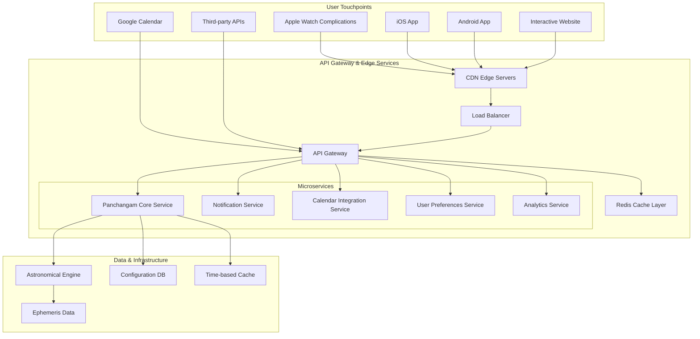
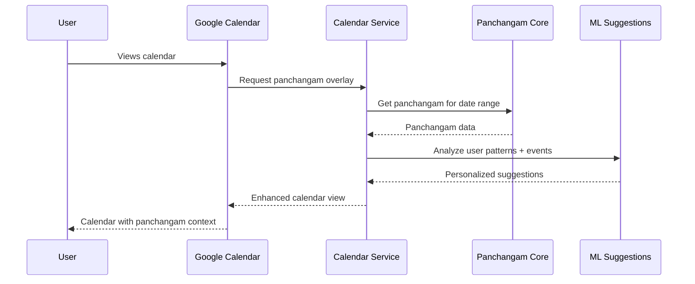
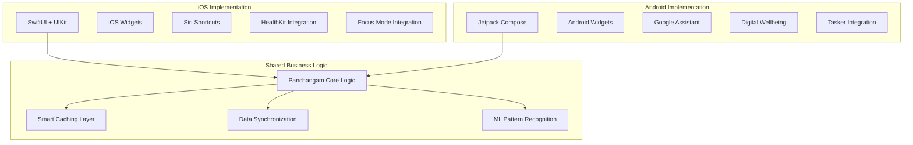
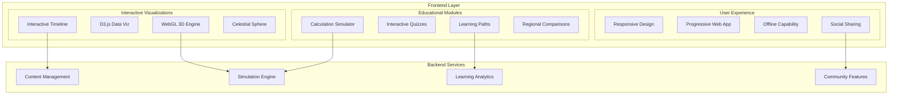
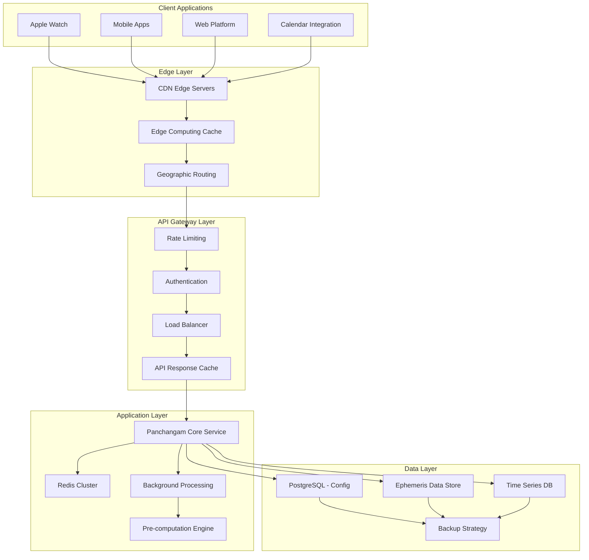

# Panchangam Everyday Integration Architecture

**Document Version**: 1.0  
**Created**: 2025-07-19  
**Author**: Architecture Design Team  
**Status**: Design Proposal  
**Review Required**: Yes

## 🎯 Executive Summary

This document outlines a comprehensive architecture for transforming the sophisticated panchangam calculation engine into a seamless everyday companion that naturally integrates into people's daily routines through multiple touchpoints - from quick glances on Apple Watch to deep exploration on interactive web platforms.

### Vision Statement

Transform the sophisticated panchangam calculation engine into a **seamless everyday companion** that naturally integrates into people's daily routines through multiple touchpoints, from quick glances on Apple Watch to deep exploration on interactive web platforms.

## 📋 Table of Contents

1. [Current Foundation Analysis](#current-foundation-analysis)
2. [Multi-Platform Integration Architecture](#multi-platform-integration-architecture)
3. [Platform-Specific Designs](#platform-specific-designs)
4. [Technical Implementation Strategy](#technical-implementation-strategy)
5. [Data Layer & Caching Strategy](#data-layer--caching-strategy)
6. [Implementation Roadmap](#implementation-roadmap)
7. [Success Metrics & Goals](#success-metrics--goals)

## 🏗️ Current Foundation Analysis

### Existing Capabilities
Based on analysis of the current panchangam project structure:

**Core Features Available**:
- **5 Panchangam Elements**: Tithi, Vara, Nakshatra, Yoga, Karana calculations
- **Astronomical Engine**: Sun/Moon positions, sunrise/sunset calculations  
- **Regional Support**: Multiple Indian regions with Amanta/Purnimanta systems
- **Multiple Methods**: Drik Ganita and Vakya calculation approaches
- **Modern Architecture**: gRPC/REST APIs with OpenTelemetry observability
- **Quality Foundation**: Comprehensive testing and structured logging

**Technical Stack**:
- **Language**: Go 1.23 with comprehensive test coverage
- **API**: gRPC with Protocol Buffers + REST endpoints
- **Observability**: OpenTelemetry tracing, structured logging
- **Architecture**: Hexagonal + microservices pattern
- **Astronomical**: Swiss Ephemeris integration planned

## 🚀 Multi-Platform Integration Architecture

### Core API Gateway Layer



### System Architecture Overview

Building on the existing gRPC/REST foundation to support diverse client needs:

**Enhanced Microservices Architecture**:
- **Panchangam Core Service**: Existing service enhanced for multi-platform support
- **Notification Service**: Smart, context-aware notifications across platforms
- **Calendar Integration Service**: Privacy-first calendar enhancement
- **User Preferences Service**: Personalization and cultural adaptation
- **Analytics Service**: Usage patterns and performance optimization

## 📱 Platform-Specific Designs

### 1. Apple Watch Complication Architecture

**Design Philosophy**: Glanceable wisdom - essential panchangam data at wrist level

#### Complication Types & Data Strategy
```yaml
Complication Types:
  corner_circular: "Tithi number + name"
  corner_text: "Current nakshatra"
  graphic_bezel: "Day's panchangam wheel"
  graphic_corner: "Rahu kalam indicator"
  graphic_circular: "Today's auspiciousness meter"
  graphic_extra_large: "Full day overview with timings"

Data Strategy:
  push_frequency: "Every 3 hours + on-demand"
  cache_duration: "24 hours with smart refresh"
  offline_capability: "3 days pre-cached data"
  
Technical Implementation:
  watchos_widgets: "iOS 17+ WidgetKit integration"
  background_refresh: "Smart scheduling based on user interaction"
  health_integration: "Optional meditation reminders during favorable muhurtas"
```

#### Apple Watch Data Model
```swift
struct WatchPanchangamData {
    let tithiInfo: TithiCompact
    let nakshatraInfo: NakshatraCompact  
    let currentMuhurta: MuhurtaStatus
    let nextSignificantEvent: EventCompact
    let rahuKalam: TimeRange?
    let auspiciousnessScore: Float // 0.0-1.0
    let updatedAt: Date
}

struct TithiCompact {
    let number: Int
    let name: String
    let percentage: Float
    let quality: String // "Auspicious", "Neutral", "Challenging"
}
```

#### Smart Update Strategy
```yaml
Update Triggers:
  tithi_transition: "15 minutes before/after tithi change"
  nakshatra_transition: "30 minutes before/after nakshatra change"  
  significant_events: "Rahu kalam start/end, festival days"
  user_interaction: "When user taps complication"
  
Battery Optimization:
  background_refresh: "Limited to 8 updates per day maximum"
  intelligent_scheduling: "More updates during waking hours"
  context_awareness: "Reduce updates during sleep/focus modes"
  
Data Efficiency:
  compressed_payload: "Minimal JSON with only essential data"
  diff_updates: "Only send changed fields"
  local_computation: "Simple calculations on-device when possible"
```

### 2. Google Calendar Integration System

**Design Philosophy**: Contextual calendar enhancement with cultural intelligence

#### Calendar Integration Sequence


#### Calendar Enhancement Features
```yaml
Auto-Enhancement:
  festival_marking: "Automatic festival detection and decoration"
  muhurta_suggestions: "AI-powered meeting time optimization"
  event_warnings: "Gentle alerts for important timings"
  
Smart Suggestions:
  meeting_scheduling: "Suggest favorable muhurtas for important meetings"
  travel_planning: "Highlight auspicious departure times"
  life_events: "Recommend timing for ceremonies, housewarmings"
  
Privacy-First:
  local_processing: "User pattern analysis stays on device where possible"
  opt_in_features: "All AI suggestions require explicit consent"
  data_minimization: "Only necessary calendar metadata processed"
```

#### Integration API Design
```javascript
// Google Calendar Add-on Architecture
class PanchangamCalendarAddon {
  constructor(private panchangamAPI: PanchangamAPI) {}
  
  // Calendar event enhancement
  async enhanceEvent(event: CalendarEvent): Promise<EnhancedEvent> {
    const panchangamData = await this.panchangamAPI.getPanchangamForDate(
      event.date,
      event.location || this.getUserLocation()
    )
    
    return {
      ...event,
      panchangamContext: this.generateContextualInfo(event, panchangamData),
      auspiciousnessScore: this.calculateAuspiciousness(event, panchangamData),
      alternatives: await this.suggestAlternativeTimes(event, panchangamData)
    }
  }
  
  // Smart scheduling suggestions
  async suggestMeetingTimes(
    participants: Participant[],
    duration: Duration,
    preferences: SchedulingPreferences
  ): Promise<MuhurtaSuggestion[]> {
    // AI-powered scheduling that considers:
    // 1. Participant availability
    // 2. Panchangam favorability
    // 3. Personal preference patterns
    // 4. Cultural considerations
  }
}
```

### 3. Mobile App Architecture (iOS/Android)

**Design Philosophy**: Progressive depth - casual users to serious practitioners

#### Cross-Platform Strategy


#### Progressive User Experience Strategy
```yaml
App Onboarding Flow:
  welcome_screen: "Brief introduction to panchangam concepts"
  location_setup: "GPS location with privacy-first approach"
  interest_profiling: "Casual/Interested/Practitioner classification"
  notification_preferences: "Granular control over alerts"
  
Feature Progressive Disclosure:
  level_1_casual: 
    - "Today's essentials card"
    - "Simple festival notifications"
    - "Basic muhurta finder"
    
  level_2_interested:
    - "7-day planning view"
    - "Detailed event descriptions"
    - "Muhurta planning tools"
    - "Regional customization"
    
  level_3_practitioner:
    - "Full astronomical calculations"
    - "Historical data analysis"
    - "Custom event tracking"
    - "API access and data export"

Smart Notification System:
  adaptive_timing: "Learn user's wake/sleep patterns"
  contextual_relevance: "Important events only, no spam"
  actionable_insights: "Notifications include quick actions"
  cultural_sensitivity: "Respect fasting/meditation periods"
```

#### Native iOS Implementation
```swift
// iOS App Architecture using Clean Architecture + MVVM
struct PanchangamApp: App {
    var body: some Scene {
        WindowGroup {
            ContentView()
                .environmentObject(PanchangamStore())
                .onAppear {
                    setupNotifications()
                    configureAnalytics()
                    initializeCoreData()
                }
        }
    }
}

// State Management with Combine
class PanchangamStore: ObservableObject {
    @Published var currentPanchangam: PanchangamData?
    @Published var userPreferences: UserPreferences
    @Published var favoriteLocations: [Location]
    
    private let apiService: PanchangamAPIService
    private let cacheManager: LocalCacheManager
    private let notificationManager: NotificationManager
    
    func loadTodaysPanchangam() async {
        // Smart loading with cache-first strategy
        // Intelligent background refresh
        // Offline-first data access
    }
}
```

### 4. Interactive Web Platform

**Design Philosophy**: Educational discovery through simulation and exploration

#### Interactive Features Architecture


#### Educational Content Strategy
```yaml
Learning Pathways:
  beginner_path:
    - "What is Panchangam? (Interactive intro)"
    - "The Five Elements (Visual breakdown)"
    - "How Calculations Work (Step-by-step)"
    - "Regional Variations (Interactive map)"
    - "Modern Relevance (Case studies)"
    
  intermediate_path:
    - "Astronomical Foundations (3D visualization)"
    - "Mathematical Principles (Interactive formulas)"
    - "Historical Development (Timeline)"
    - "Cultural Significance (Rich media)"
    - "Practical Applications (Simulation)"
    
  advanced_path:
    - "Precision and Accuracy (Comparison tools)"
    - "Software Implementation (Code examples)"
    - "Research Methods (Historical validation)"
    - "Contemporary Applications (API playground)"

Interactive Quizzes:
  knowledge_check: "Multiple choice with immediate feedback"
  calculation_practice: "Guided step-by-step problems"
  cultural_context: "Scenario-based questions"
  visual_recognition: "Identify panchangam elements in charts"

Gamification Elements:
  achievement_system: "Unlock badges for learning milestones"
  progress_tracking: "Visual progress through learning paths"
  leaderboards: "Community knowledge competitions"
  challenges: "Daily/weekly calculation challenges"
```

## 🎨 Design System & User Experience

### Unified Visual Language
```yaml
Design Principles:
  accessibility_first: "WCAG 2.1 AA compliance across all platforms"
  cultural_sensitivity: "Respectful representation of traditions"
  progressive_disclosure: "Information depth matching user interest"
  performance_optimized: "Sub-3s load times on 3G networks"

Color Palette:
  primary: "#FF6B35" # Saffron
  secondary: "#4A90E2" # Sky Blue  
  success: "#7ED321" # Auspicious Green
  warning: "#F5A623" # Caution Amber
  neutral: "#9B9B9B" # Balanced Gray

Typography:
  primary_font: "Noto Sans (multi-script support)"
  accent_font: "Noto Sans Devanagari (traditional text)"
  mono_font: "JetBrains Mono (calculations)"
```

### Cross-Platform Design Consistency
```yaml
Component Library:
  daily_card: "Consistent across watch, mobile, web"
  timing_display: "Unified time representation"
  quality_indicator: "Visual auspiciousness scale"
  event_badge: "Standardized event marking"
  
Responsive Breakpoints:
  watch: "42mm/44mm Apple Watch optimization"
  mobile: "375px-414px primary targets"
  tablet: "768px-1024px landscape/portrait"
  desktop: "1280px+ with max-width constraints"
```

## 🔧 Data Layer & Intelligent Caching Strategy

### Multi-Tier Caching Architecture


### Intelligent Caching Strategy
```yaml
Cache Hierarchy Levels:

Level 1 - Client Cache (1-7 days):
  apple_watch: "3 days basic panchangam + 1 day detailed"
  mobile_app: "7 days comprehensive + 30 days basic"
  web_browser: "1 day detailed + 7 days basic"
  calendar_addon: "30 days festival data + 7 days muhurtas"

Level 2 - CDN Edge (24 hours):
  static_assets: "Images, CSS, JS files with 1-year expiry"
  api_responses: "Location-based caching for popular cities"
  precomputed_data: "Major cities pre-calculated for next 24 hours"

Level 3 - API Gateway (6 hours):
  rate_limiting: "User request limits and throttling state"
  authentication: "JWT token validation cache"
  response_cache: "Identical request responses cached for 6 hours"

Level 4 - Application Cache (1-24 hours):
  redis_hot: "Current day data for top 100 cities (1 hour TTL)"
  redis_warm: "Next 7 days for top 1000 cities (6 hour TTL)"
  redis_cold: "Historical data and rare locations (24 hour TTL)"

Level 5 - Database Layer:
  postgres: "Configuration, user preferences, regional settings"
  ephemeris: "Raw astronomical data with infinite TTL"
  time_series: "Historical panchangam calculations"
```

### Database Architecture
```sql
-- Optimized database schema for panchangam data
CREATE TABLE locations (
    id SERIAL PRIMARY KEY,
    name VARCHAR(255) NOT NULL,
    latitude DECIMAL(10, 8) NOT NULL,
    longitude DECIMAL(11, 8) NOT NULL,
    timezone VARCHAR(50) NOT NULL,
    region VARCHAR(50) NOT NULL,
    usage_count INTEGER DEFAULT 0,
    last_accessed TIMESTAMP DEFAULT NOW(),
    
    INDEX idx_coordinates (latitude, longitude),
    INDEX idx_region (region),
    INDEX idx_usage (usage_count DESC, last_accessed DESC)
);

CREATE TABLE panchangam_cache (
    id SERIAL PRIMARY KEY,
    location_id INTEGER REFERENCES locations(id),
    date DATE NOT NULL,
    calculation_method VARCHAR(20) NOT NULL,
    
    -- Compressed JSON data for fast retrieval
    panchangam_data JSONB NOT NULL,
    
    created_at TIMESTAMP DEFAULT NOW(),
    expires_at TIMESTAMP NOT NULL,
    access_count INTEGER DEFAULT 0,
    
    UNIQUE INDEX idx_cache_lookup (location_id, date, calculation_method),
    INDEX idx_expiry (expires_at),
    INDEX idx_date_range (date, location_id)
);

-- Partitioned table for historical data
CREATE TABLE panchangam_historical (
    date DATE NOT NULL,
    location_id INTEGER NOT NULL,
    panchangam_data JSONB NOT NULL,
    created_at TIMESTAMP DEFAULT NOW()
) PARTITION BY RANGE (date);
```

### Performance Optimization Strategy
```yaml
Database Optimization:
  connection_pooling: "pgbouncer with 100 max connections"
  read_replicas: "3 read replicas across different regions"
  connection_distribution: "Read queries distributed, writes to primary"
  query_optimization: "EXPLAIN ANALYZE on all queries, sub-100ms target"

Cache Optimization:
  redis_cluster: "6-node cluster with auto-failover"
  memory_management: "LRU eviction with intelligent retention"
  connection_pooling: "Connection reuse across requests"
  data_compression: "GZIP compression for large responses"

Application Optimization:
  concurrent_processing: "Goroutines for parallel calculations"
  request_batching: "Batch multiple location requests"
  response_streaming: "Stream large datasets instead of buffering"
  resource_pooling: "Object pools for expensive calculations"

Monitoring & Analytics:
  performance_metrics: "Response time, cache hit ratio, error rates"
  usage_analytics: "Location popularity, peak usage patterns"
  cost_optimization: "Cloud resource usage analysis"
  predictive_scaling: "Auto-scaling based on historical patterns"
```

## 📈 Implementation Roadmap

### Phase-Based Rollout Strategy

#### Phase 1: Foundation (Months 1-3)
```yaml
Core Infrastructure:
  - Enhance existing API gateway for multi-platform support
  - Implement Redis caching layer with intelligent TTL
  - Set up CDN and edge computing infrastructure
  - Create unified authentication system across platforms

Success Metrics:
  - API response time < 100ms (95th percentile)
  - 99.9% uptime for core services
  - Cache hit ratio > 85%
  - Zero data consistency issues
```

#### Phase 2: Mobile-First Launch (Months 4-6)
```yaml
Mobile Applications:
  - iOS app with Apple Watch complications
  - Android app with widgets and Google Assistant integration
  - Progressive Web App for broader accessibility
  - Smart notification system with user learning

Success Metrics:
  - App Store rating > 4.5 stars
  - Daily active users > 10,000 within 6 months
  - Average session duration > 3 minutes
  - Notification engagement rate > 25%
```

#### Phase 3: Calendar & Productivity Integration (Months 7-9)
```yaml
Productivity Integration:
  - Google Calendar add-on with AI suggestions
  - Apple Calendar integration via EventKit
  - Microsoft Outlook plugin
  - Slack/Teams bot for team scheduling

Success Metrics:
  - Calendar integration adoption > 30% of active users
  - Muhurta suggestion acceptance rate > 15%
  - Average user saves 20+ minutes per week on scheduling
  - Zero privacy compliance issues
```

#### Phase 4: Educational Platform Launch (Months 10-12)
```yaml
Web Platform:
  - Interactive 3D celestial visualizations
  - Progressive learning pathways
  - Community features and expert Q&A
  - Regional comparison tools

Success Metrics:
  - Learning completion rate > 60%
  - Community engagement (posts/comments) > 500/month
  - Expert response time < 24 hours
  - Educational content accuracy verified by traditional scholars
```

## 🎯 Success Metrics & Goals

### Cultural Impact & Accessibility Goals

#### Global Accessibility
```yaml
Localization Strategy:
  - 12 Indian languages with native script support
  - Cultural adaptation for diaspora communities
  - Accessibility compliance (WCAG 2.1 AA)
  - Support for 50+ global cities by end of Year 1

Community Building:
  - Partner with traditional panchangam makers
  - Academic collaboration for historical validation
  - Open-source components for developer ecosystem
  - Cultural preservation through digital archives
```

#### Technology Innovation
```yaml
AI/ML Integration:
  - Personalized recommendation engine
  - Pattern recognition for user preferences
  - Predictive caching based on usage analytics
  - Natural language interface for complex queries

Future Enhancements:
  - Augmented reality celestial overlays
  - IoT integration (smart home automation)
  - Voice assistant natural language processing
  - Blockchain-based cultural heritage preservation
```

## 🏛️ Architectural Principles Summary

The designed architecture achieves:

1. **🔄 Seamless Integration**: Natural integration into daily workflows through multiple touchpoints
2. **⚡ Performance Excellence**: Sub-100ms responses with intelligent multi-tier caching
3. **🌍 Cultural Sensitivity**: Respectful representation of traditions with modern accessibility  
4. **📱 Platform Native**: Native performance and UX patterns on each platform
5. **🎓 Progressive Learning**: From casual glances to deep astronomical education
6. **🔐 Privacy-First**: User data protection with transparent privacy controls
7. **🚀 Scalable Foundation**: Architecture supports millions of users with graceful scaling

### Design Philosophy

This comprehensive system transforms the sophisticated panchangam calculation engine into an everyday companion that brings ancient astronomical wisdom into modern digital life, respecting tradition while embracing innovation for global accessibility.

The architecture is designed for **long-term sustainability**, **cultural authenticity**, and **technological excellence** - creating a bridge between timeless wisdom and contemporary convenience.

---

## 📝 Next Steps

1. **Review this architecture document** and provide feedback
2. **Prioritize platform development** based on target audience
3. **Define detailed technical specifications** for Phase 1 implementation
4. **Establish partnerships** with traditional panchangam makers and cultural experts
5. **Create development team structure** and resource allocation plan

---

**Document Status**: Ready for Review  
**Stakeholder Review Required**: Yes  
**Technical Review Required**: Yes  
**Cultural Expert Review Required**: Yes