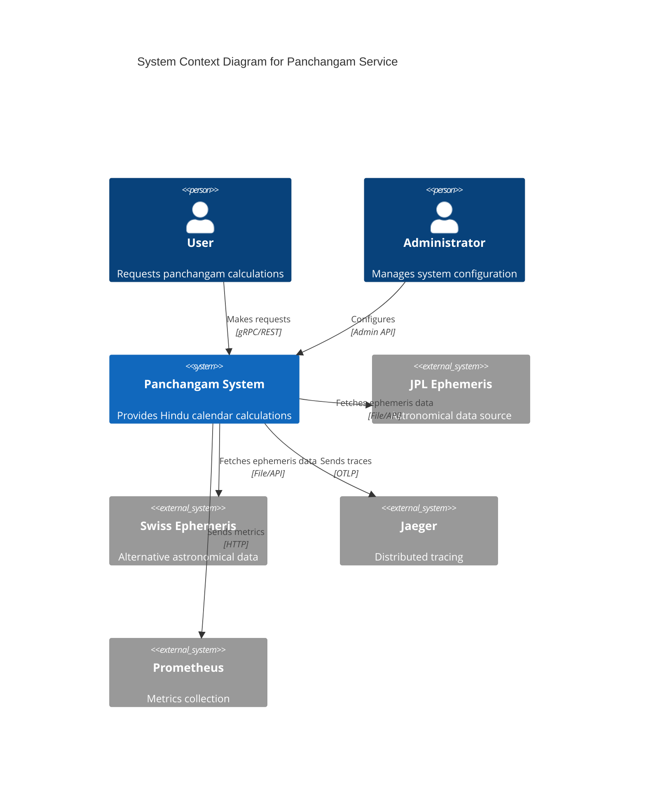
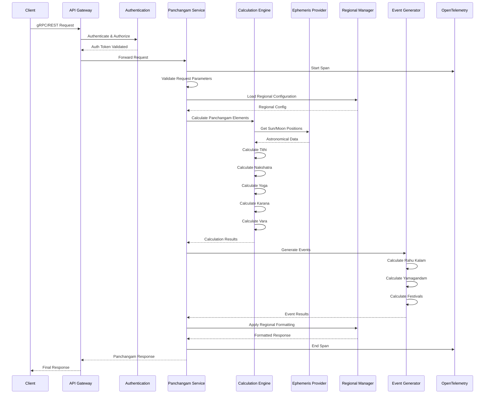
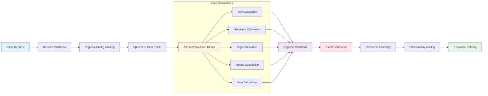
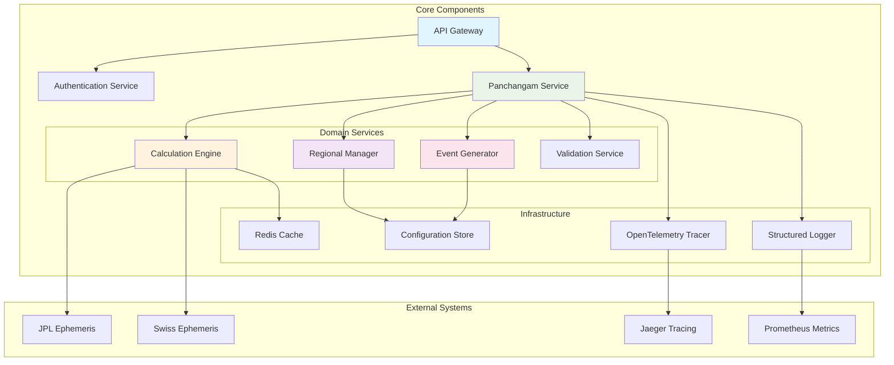
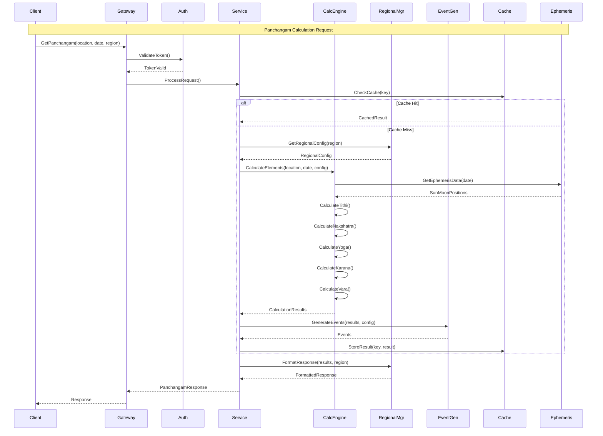
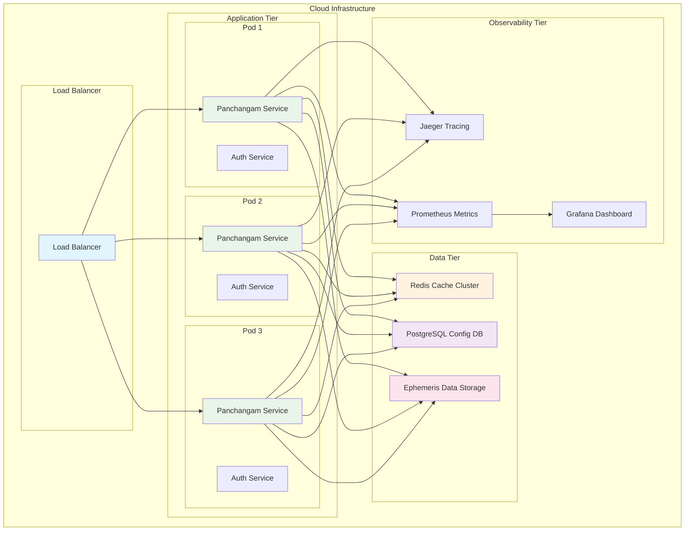
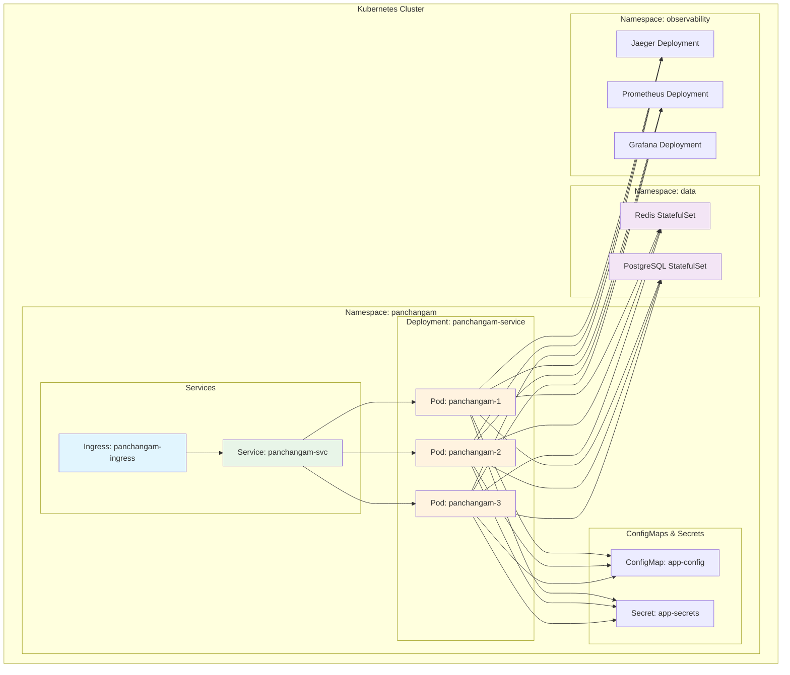

# Panchangam Project: High-Level Architecture

## 📋 Executive Summary

The Panchangam project is a comprehensive **Hindu calendar system** that provides astronomical calculations, regional variations, and traditional calendar data through a modern microservices architecture. The system combines ancient astronomical knowledge with contemporary observability and scalability patterns.

## 🎯 Project Scope Analysis

Based on 40 GitHub issues and implementation plan analysis:

### **Core Features**
- **5 Panchangam Elements**: Tithi, Vara, Nakshatra, Yoga, Karana
- **Astronomical Calculations**: Sun/Moon positions, sunrise/sunset times
- **Regional Support**: Tamil Nadu, Kerala, Bengal, Gujarat, Maharashtra
- **Multiple Calculation Methods**: Drik Ganita, Vakya
- **Calendar Systems**: Amanta (South India), Purnimanta (North India)
- **Event Generation**: Rahu Kalam, Yamagandam, festivals, muhurta
- **Observability**: OpenTelemetry tracing, structured logging

### **Quality Requirements**
- **Accuracy**: Cross-validation with traditional sources
- **Performance**: Optimized astronomical calculations
- **Scalability**: Microservices architecture
- **Extensibility**: Plugin-based regional variations
- **Observability**: Comprehensive monitoring and tracing

## 🏛️ System Architecture

### **Architecture Pattern: Hexagonal + Microservices**

```mermaid
graph TB
    subgraph "Presentation Layer"
        A[gRPC API Gateway]
        B[REST API]
        C[CLI Tools]
        D[Web Dashboard]
    end
    
    subgraph "Core Services"
        E[Panchangam Service]
        F[Authentication & Authorization]
        G[Observability & Logging]
        
        E --> F
        E --> G
    end
    
    subgraph "Domain Layer"
        subgraph "Astronomical Calculations"
            H[Tithi Calculator]
            I[Nakshatra Calculator]
            J[Yoga Calculator]
            K[Karana Calculator]
            L[Vara Calculator]
        end
        
        subgraph "Regional Variations"
            M[Amanta/Purnimanta Systems]
            N[Drik/Vakya Methods]
            O[Regional Logic Engine]
            P[Language/Time Units]
        end
        
        subgraph "Event Generation"
            Q[Rahu Kalam Calculator]
            R[Yamagandam Calculator]
            S[Festival Calculator]
            T[Muhurta Calculator]
        end
    end
    
    subgraph "Infrastructure Layer"
        subgraph "Ephemeris Integration"
            U[JPL DE440]
            V[Swiss Ephemeris]
            W[Interpolation Engine]
        end
        
        subgraph "Data Storage"
            X[Configuration Store]
            Y[Cache Store]
            Z[Regional Data]
        end
        
        subgraph "Observability Stack"
            AA[OpenTelemetry]
            BB[Jaeger Tracing]
            CC[Prometheus Metrics]
        end
    end
    
    A --> E
    B --> E
    C --> E
    D --> E
    
    E --> H
    E --> I
    E --> J
    E --> K
    E --> L
    
    E --> M
    E --> N
    E --> O
    E --> P
    
    E --> Q
    E --> R
    E --> S
    E --> T
    
    H --> U
    H --> V
    I --> U
    I --> V
    J --> U
    J --> V
    K --> U
    K --> V
    L --> U
    L --> V
    
    E --> X
    E --> Y
    E --> Z
    
    G --> AA
    G --> BB
    G --> CC
```



### **System Architecture Overview**



## 📦 Component Architecture

### **1. Core Domain Components**

#### **Astronomical Calculation Engine**
```go
// Core astronomical calculations with context awareness
type AstronomicalCalculator interface {
    CalculateTithi(ctx context.Context, req *CalculationRequest) (*TithiResult, error)
    CalculateNakshatra(ctx context.Context, req *CalculationRequest) (*NakshatraResult, error)
    CalculateYoga(ctx context.Context, req *CalculationRequest) (*YogaResult, error)
    CalculateKarana(ctx context.Context, req *CalculationRequest) (*KaranaResult, error)
    CalculateVara(ctx context.Context, req *CalculationRequest) (*VaraResult, error)
}
```

#### **Regional Variations Manager**
```go
// Handles regional calendar systems and calculation methods
type RegionalVariationsManager interface {
    GetCalculationMethod(region string) CalculationMethod
    GetCalendarSystem(region string) CalendarSystem
    GetRegionalEvents(region string, date time.Time) []Event
    GetTimeUnits(region string) TimeUnitSystem
}
```

#### **Event Generation System**
```go
// Generates panchangam events and muhurta calculations
type EventGenerator interface {
    GenerateRahuKalam(ctx context.Context, location Location, date time.Time) (*Event, error)
    GenerateYamagandam(ctx context.Context, location Location, date time.Time) (*Event, error)
    GenerateFestivals(ctx context.Context, req *FestivalRequest) ([]Event, error)
    CalculateMuhurta(ctx context.Context, req *MuhurtaRequest) (*MuhurtaResult, error)
}
```

### **2. Infrastructure Components**

#### **Ephemeris Integration Layer**
```go
// Astronomical data source abstraction
type EphemerisProvider interface {
    GetPlanetaryPositions(ctx context.Context, jd float64) (*PlanetaryPositions, error)
    GetSunPosition(ctx context.Context, jd float64) (*SolarPosition, error)
    GetMoonPosition(ctx context.Context, jd float64) (*LunarPosition, error)
    InterpolatePositions(ctx context.Context, jd float64) (*InterpolatedPositions, error)
}
```

#### **Data Storage Layer**
```go
// Configuration and cache management
type StorageManager interface {
    GetRegionalConfiguration(region string) (*RegionalConfig, error)
    CacheEphemerisData(ctx context.Context, data *EphemerisData) error
    GetCachedCalculation(ctx context.Context, key string) (*CalculationResult, error)
    StoreCalculation(ctx context.Context, key string, result *CalculationResult) error
}
```

## 🔧 Service Architecture

### **Panchangam Service (Current)**
- **Purpose**: Main API endpoint for panchangam calculations
- **Status**: ✅ Implemented with OpenTelemetry tracing
- **Features**: Authentication, authorization, comprehensive logging
- **Dependencies**: Astronomy package, Observability package

### **Future Service Expansion**

#### **1. Astronomical Calculation Service**
```yaml
Purpose: Dedicated astronomical calculations
Endpoints:
  - /calculate/tithi
  - /calculate/nakshatra
  - /calculate/yoga
  - /calculate/karana
  - /calculate/vara
Dependencies: Ephemeris providers
```

#### **2. Regional Variations Service**
```yaml
Purpose: Region-specific logic and data
Endpoints:
  - /regional/config/{region}
  - /regional/events/{region}
  - /regional/festivals/{region}
Features: Multi-language support, local customs
```

#### **3. Event Generation Service**
```yaml
Purpose: Panchangam events and muhurta
Endpoints:
  - /events/rahu-kalam
  - /events/yamagandam
  - /events/festivals
  - /muhurta/calculate
Dependencies: Astronomical calculations
```

#### **4. Validation Service**
```yaml
Purpose: Cross-validation with traditional sources
Endpoints:
  - /validate/calculation
  - /validate/accuracy
  - /validate/historical
Features: Accuracy metrics, comparison reports
```

## 🌊 Data Flow Architecture

### **Request Processing Sequence**



### **Calculation Pipeline Flow**



### **Data Flow Patterns**

```mermaid
graph LR
    subgraph "Input Processing"
        A[Location + Date + Region] --> B[Parameter Validation]
        B --> C[Regional Configuration]
    end
    
    subgraph "Astronomical Processing"
        C --> D[Ephemeris Data]
        D --> E[Sun/Moon Positions]
        E --> F[Astronomical Calculations]
    end
    
    subgraph "Cultural Processing"
        F --> G[Regional Variations]
        G --> H[Event Generation]
        H --> I[Cultural Formatting]
    end
    
    subgraph "Output Processing"
        I --> J[Response Validation]
        J --> K[Observability Data]
        K --> L[Final Response]
    end
    
    style A fill:#e3f2fd
    style L fill:#e8f5e8
    style F fill:#fff8e1
    style H fill:#fce4ec
```



## 🔧 Component Interactions

### **Service Component Diagram**



### **Component Interaction Patterns**



## 🚀 Deployment Architecture

### **Deployment Diagram**



### **Kubernetes Deployment**



## 📊 Technology Stack

### **Current Stack**
- **Language**: Go 1.23
- **API**: gRPC with Protocol Buffers
- **Observability**: OpenTelemetry, Jaeger tracing
- **Authentication**: Custom AAA interceptors
- **Testing**: Comprehensive test suite (>95% coverage)

### **Planned Integrations**
- **Ephemeris**: JPL DE440, Swiss Ephemeris
- **Storage**: Redis (cache), PostgreSQL (configuration)
- **Monitoring**: Prometheus, Grafana
- **Deployment**: Docker, Kubernetes

## 🚀 Implementation Roadmap

### **Phase 1: Foundation (Months 1-3)**
**Priority: Critical**
- ✅ **Sunrise/Sunset Calculations** (Issue #5 - DONE)
- ✅ **OpenTelemetry Tracing** (Issue #39 - DONE)
- ✅ **Service Logging** (Issue #38 - DONE)
- 🔄 **Ephemeris Integration** (Issue #24 - IN PROGRESS)
- 🔄 **Moon/Sun Longitude** (Issue #1 - IN PROGRESS)

### **Phase 2: Core Panchangam (Months 4-6)**
**Priority: High**
- **Tithi Calculations** (Issues #2, #3, #4)
- **Nakshatra System** (Issues #9, #10, #11, #12)
- **Yoga Calculations** (Issues #13, #14, #15)
- **Karana System** (Issues #16, #17, #18)
- **Vara Assignment** (Issues #6, #7, #8)

### **Phase 3: Regional & Events (Months 7-9)**
**Priority: Medium**
- **Regional Variations** (Issues #20, #21, #22, #23)
- **Event Generation** (Issue #19)
- **Festival Calculations** (Issue #31)
- **Muhurta System** (Issue #32)

### **Phase 4: Advanced Features (Months 10-12)**
**Priority: Low**
- **Planetary Integration** (Issues #24, #25, #26)
- **UI/UX Development** (Issues #27, #28, #29, #30)
- **Validation System** (Issue #33)
- **Documentation** (Issue #36)

## 🎯 Architecture Principles

### **Design Principles**
1. **Hexagonal Architecture**: Clean separation of concerns
2. **Domain-Driven Design**: Astronomical calculations as core domain
3. **Microservices**: Independently deployable services
4. **Context Awareness**: Request context propagation
5. **Observability First**: Comprehensive tracing and logging

### **Quality Attributes**
- **Accuracy**: ±1 minute precision for astronomical calculations
- **Performance**: <100ms response time for single calculations
- **Scalability**: Horizontal scaling with load balancing
- **Reliability**: 99.9% uptime with graceful degradation
- **Extensibility**: Plugin architecture for regional variations

### **Integration Patterns**
- **API Gateway**: Centralized request routing and authentication
- **Event Sourcing**: Calculation history and audit trails
- **CQRS**: Separate read/write models for complex calculations
- **Circuit Breaker**: Fault tolerance for ephemeris providers

## 🛡️ Security & Compliance

### **Security Measures**
- **Authentication**: JWT-based API authentication
- **Authorization**: Role-based access control
- **Input Validation**: Comprehensive parameter validation
- **Rate Limiting**: API usage throttling
- **Audit Logging**: Complete request/response logging

### **Data Privacy**
- **Location Data**: Ephemeral processing, no persistent storage
- **Personal Data**: Minimal collection, GDPR compliance
- **Calculation Results**: Cacheable but non-sensitive

## 📈 Monitoring & Observability

### **Current Implementation**
- **Distributed Tracing**: OpenTelemetry with Jaeger
- **Structured Logging**: Context-aware logging
- **Metrics Collection**: Performance and accuracy metrics
- **Error Tracking**: Comprehensive error recording

### **Future Enhancements**
- **Real-time Dashboards**: Grafana visualization
- **Alerting**: Prometheus alerting rules
- **Performance Profiling**: Continuous performance monitoring
- **Accuracy Metrics**: Validation against traditional sources

## 🏁 Summary

This **Panchangam Project** represents a sophisticated blend of **ancient astronomical knowledge** and **modern software architecture**. The system is designed to:

1. **Preserve Traditional Accuracy**: Maintain the precision of traditional panchangam calculations while leveraging modern computational power
2. **Support Regional Diversity**: Handle the rich variations in Hindu calendar systems across different regions of India
3. **Enable Future Growth**: Provide a flexible architecture that can accommodate new features and regional requirements
4. **Ensure Reliability**: Implement comprehensive observability and quality assurance measures

The **current foundation** (sunrise/sunset calculations, OpenTelemetry tracing, service logging) provides a solid base for the remaining 37 features outlined in the GitHub issues. The **hexagonal architecture** with **domain-driven design** ensures that the complex astronomical calculations remain the core focus while supporting extensibility through clean interfaces.

This architecture positions the project to become a **comprehensive, accurate, and scalable** panchangam system that honors traditional knowledge while embracing modern technology practices.

---

**Document Version**: 1.0  
**Created**: 2025-07-18  
**Last Updated**: 2025-07-18  
**Status**: Current Architecture Design  
**Next Review**: After Phase 1 completion