# Implementation Phase Diagrams

This document provides detailed Mermaid diagrams for each implementation phase of the Panchangam project.

## 🎯 Phase Implementation Overview

### **Implementation Phases Timeline**

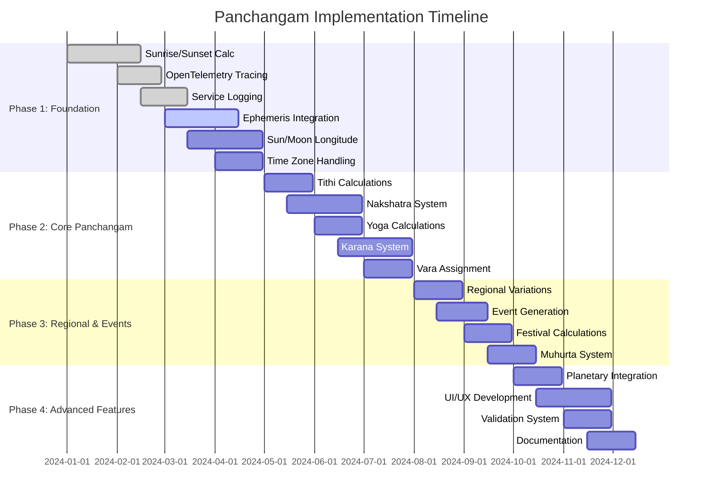

## 🏗️ Phase 1: Foundation Architecture

### **Foundation Components Flow**

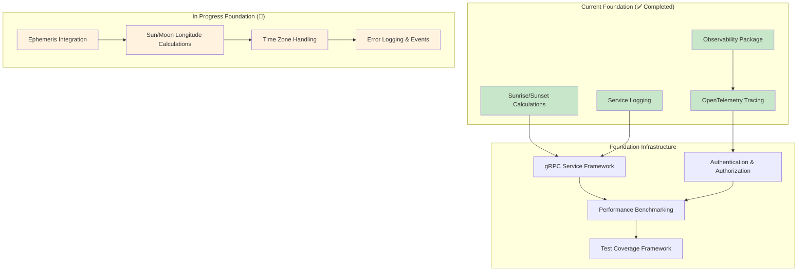

### **Ephemeris Integration Architecture**

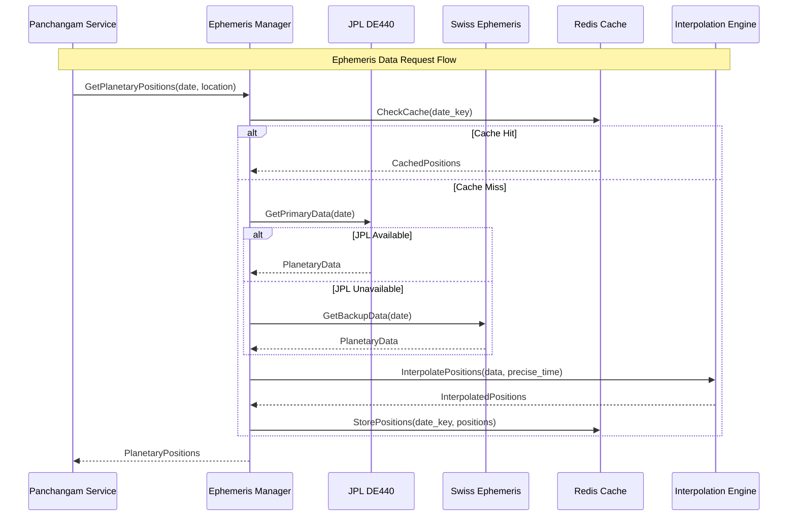

## 🌟 Phase 2: Core Panchangam Architecture

### **Five Elements Calculation Flow**

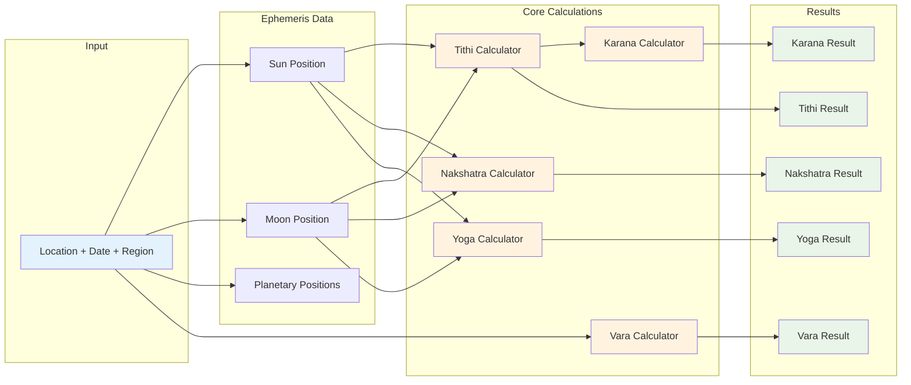

### **Tithi Calculation Sequence**

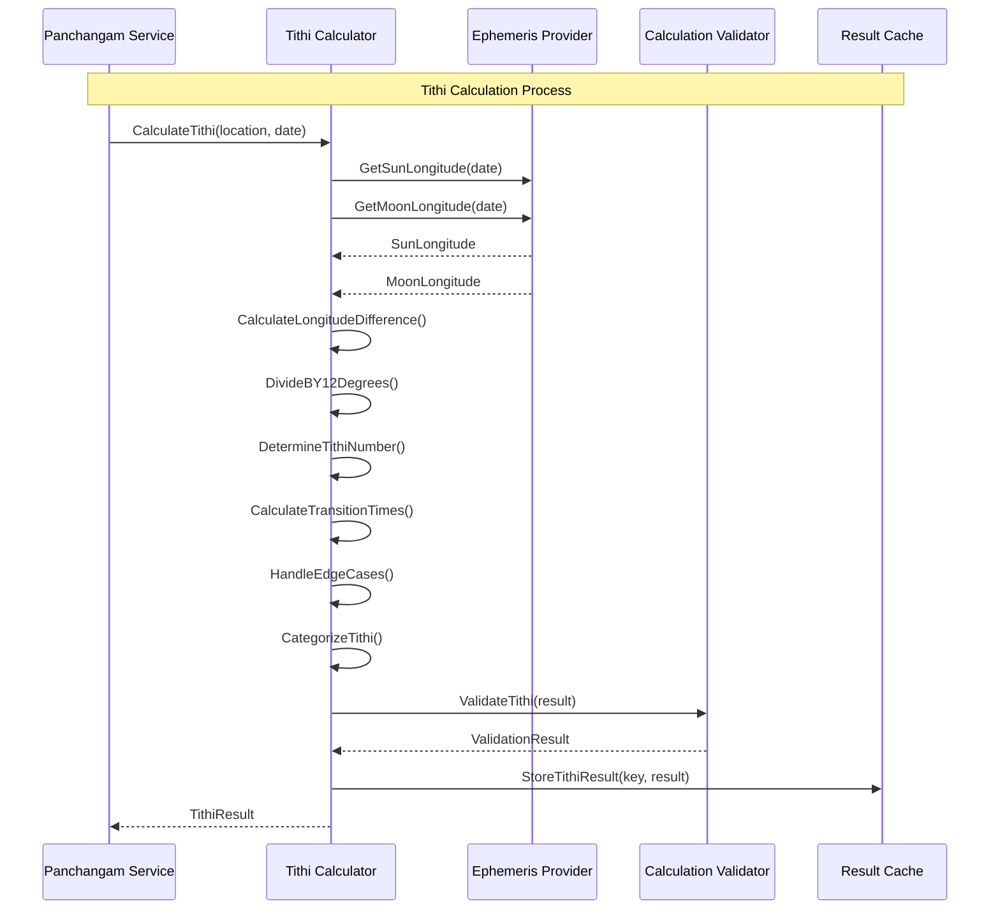

## 🌍 Phase 3: Regional & Events Architecture

### **Regional Variations System**

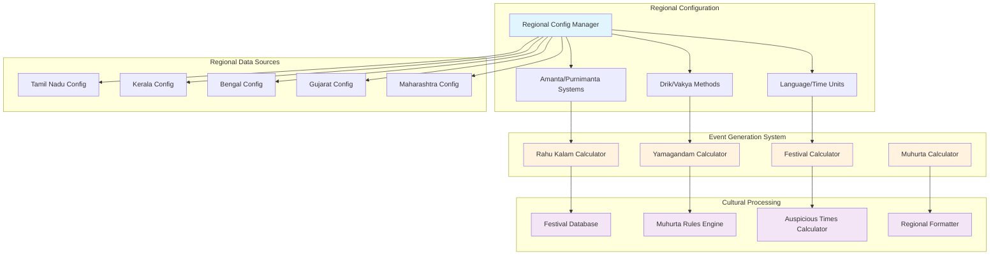

### **Event Generation Flow**

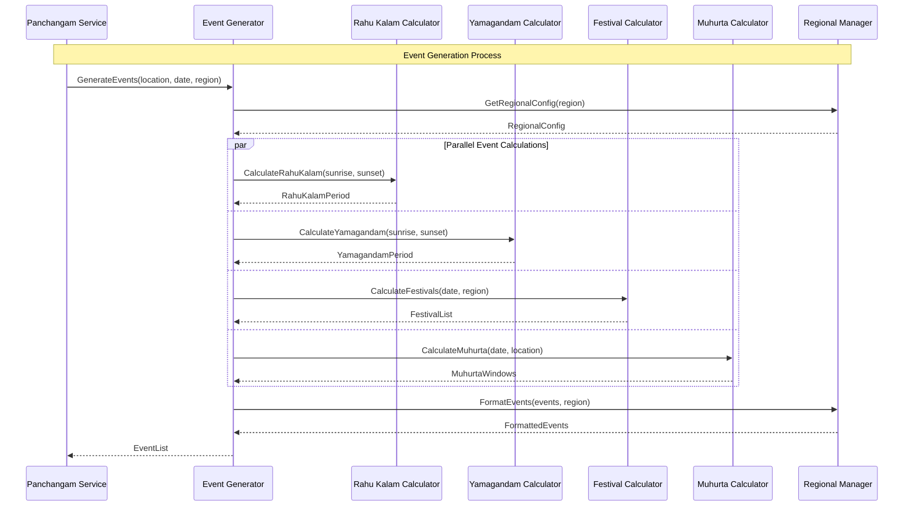

## 🚀 Phase 4: Advanced Features Architecture

### **Advanced Features Integration**

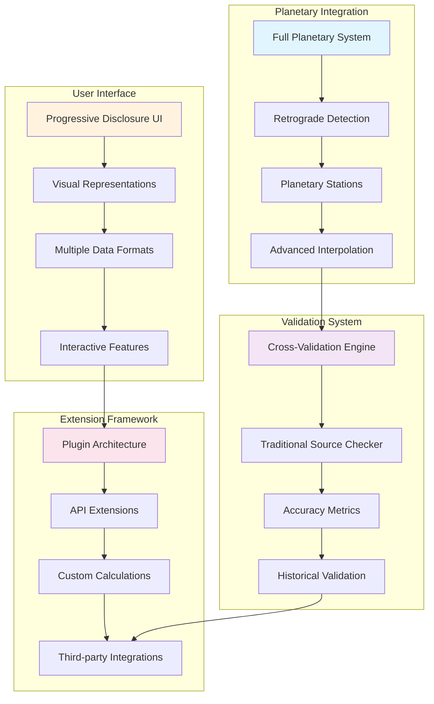

### **System Integration Flow**

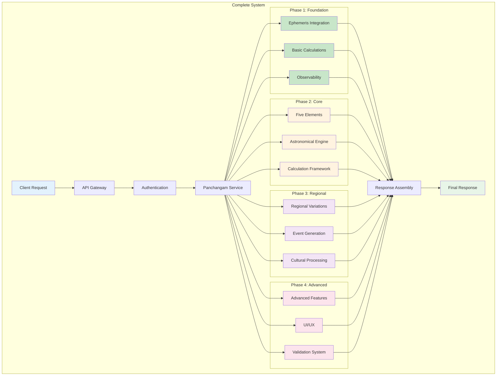

## 📊 Implementation Progress Tracking

### **Current Status Dashboard**

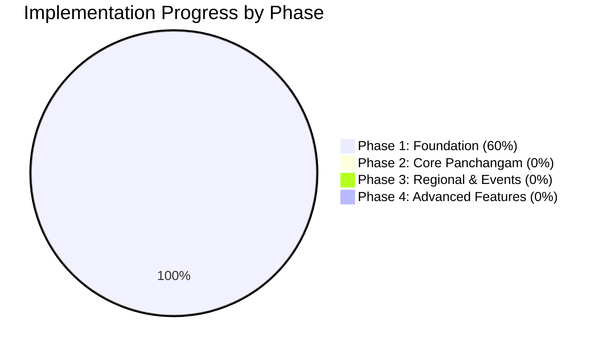

### **Milestone Dependencies**

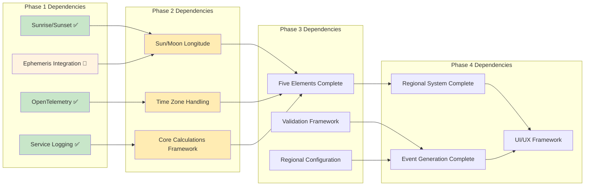

---

**Document Version**: 1.0  
**Created**: 2025-07-18  
**Last Updated**: 2025-07-18  
**Status**: Phase-specific implementation diagrams  
**Next Review**: After Phase 1 completion